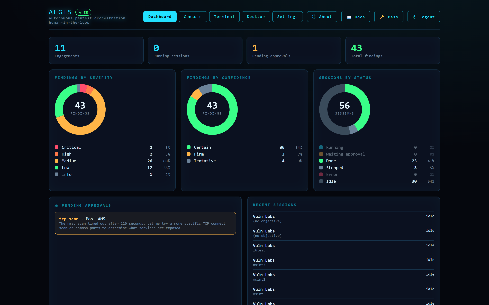
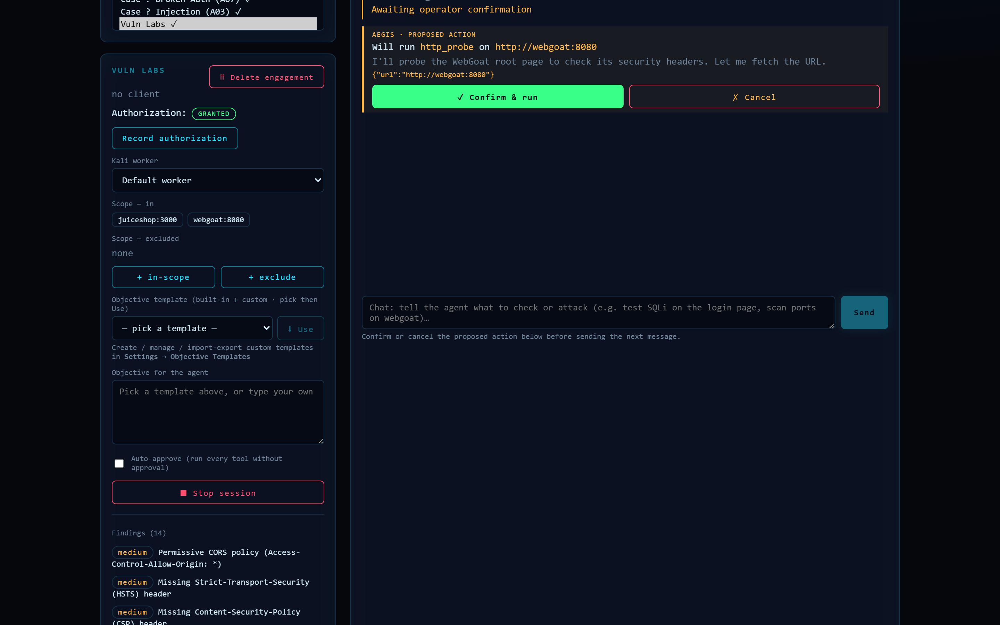
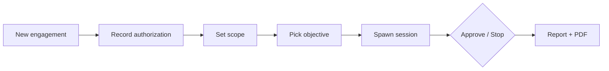

<div align="center">

# 🛡️ AEGIS

### Autonomous, human-in-the-loop AI penetration-testing orchestration

An LLM plans and drives an **authorized** engagement — but every active/offensive
action passes a **scope gate** and a **human approval gate** — and the result is a
client-ready report with evidence, impact and remediation.


-3da639?style=flat-square)


</div>

> ⚠️ **Authorized testing only.** Aegis refuses to run any active tool unless the
> target is (a) covered by recorded written authorization and (b) inside the
> engagement scope. Only test systems you own or have **written permission** to
> assess. You are responsible for compliance with all applicable laws.

---

## Why Aegis

Most "autonomous pentest" tools are a black box that runs whatever they want.
Aegis is the opposite: the AI is fast and tireless, but **you stay in control**.

| | |
| --- | --- |
| 🧠 **AI-driven** | An agent loop plans in phases (recon → scan → credential test → validate → report), calls real Kali tools, reads results, and continues — **or drive it yourself by chat**: the agent proposes each command + target and waits for your confirm (Enterprise). |
| 🚦 **Scope gate** | Recorded authorization + include/exclude rules are enforced before any network action — out-of-scope targets are blocked, always. |
| ✋ **Approval gate** | Passive tools run freely; every **active/intrusive** tool (port scan, dir enum, shell, exploit PoC) pauses for an explicit operator `approve` — the exact command is shown first. |
| 🧾 **Audit + RBAC** | Admin/operator roles; every approval, command and config change is written to an immutable audit log. |
| 📄 **Client report** | Findings become a print-ready HTML report — Burp-style scan statistics, grouped issues, and per-finding **Description / Impact / Remediation** with **Confidence** and **CVE · CVSS** → one-click **Save as PDF**. |

## Screenshots

<table>
  <tr>
    <td width="50%" valign="top"><br/><sub><b>Dashboard</b> — a cross-engagement overview: KPIs, findings by severity &amp; confidence, session status, pending approvals and live worker health.</sub></td>
    <td width="50%" valign="top"><br/><sub><b>Console</b> — set authorization + scope, pick an objective, then run an autonomous session or drive it by chat; findings stream in.</sub></td>
  </tr>
  <tr>
    <td width="50%" valign="top"><br/><sub><b>AI Chat</b> — the agent proposes the exact command + target and waits for your <b>Confirm</b> before running it (Enterprise).</sub></td>
    <td width="50%" valign="top"><br/><sub><b>Client report</b> — scan statistics (with <b>Known CVEs</b>), grouped issues, and per-finding evidence / impact / remediation → Save as PDF.</sub></td>
  </tr>
  <tr>
    <td width="50%" valign="top"><br/><sub><b>About</b> — edition &amp; license, feature matrix, and system/version info.</sub></td>
    <td width="50%" valign="top"><br/><sub><b>Sign in</b> — every route and the websocket sit behind JWT auth.</sub></td>
  </tr>
</table>

## Architecture


The **worker** is the only component that touches the target, and it only runs a
tool after the gate passes. Sessions and pending approvals are durable (MongoDB +
Redis), so a backend restart never loses an in-flight engagement.

## Quick start

```bash
git clone https://github.com/Chakkrit-Jans/aegis.git
cd aegis
cp .env.example .env         # set JWT_SECRET and WORKER_TOKEN
docker compose up -d --build
```

Open **http://localhost:3000**, sign in with `admin` / `admin1234` (change it
immediately), add an AI provider in **Settings → AI Providers**, then:



> Everything is configured in the UI and stored in MongoDB — only bootstrap
> secrets (`JWT_SECRET`, `WORKER_TOKEN`, `MONGO_URL`) live in `.env`. A production
> overlay with automatic HTTPS is in [`docs/deploy.md`](docs/deploy.md).

## Features

- **Dashboard** — a cross-engagement overview: KPIs, findings by severity &
  confidence, session status, pending approvals, and live worker health.
- **Discovery tools** — map a fingerprinted version to known **CVEs**, scan a page
  and its JavaScript for **leaked API keys** (masked), and OSINT a domain's likely
  **origin IP behind Cloudflare** (Shodan / Censys / SecurityTrails).
- **AI Chat control** *(Enterprise)* — drive the assessment conversationally:
  propose → confirm → run → log, one step at a time, or steer a running session live.
- **Exploitation & post-exploitation** *(Enterprise, L4–L7)* — SQLi/XSS/command-
  injection validation (sqlmap, dalfox, commix), Metasploit `check`, offline hash
  cracking (hashcat), and an Active-Directory suite (NetExec, BloodHound, kerbrute,
  certipy, secretsdump) — all capped to **proof / enumeration**, scope + approval gated.
- **Multi-worker** — real tooling runs in isolated Kali containers over a
  token-gated exec agent; assign each engagement its own worker.
- **Live vuln feeds** — nuclei templates, Exploit-DB and nmap NSE stay current
  (manual on every enabled worker).
- **Operator terminal + Kali desktop (noVNC)** — a scoped, audited shell and a
  full XFCE desktop (Burp, Firefox) in the browser.
- **Telegram gateway** — approve/reject from your phone.
- **Burp / Caido proxy** — route active web tools through your intercepting proxy.
- **Objective templates** — 7 categories × 3 levels, plus your own custom templates.
- **Provider-pluggable AI** — DeepSeek, Anthropic (Claude), or any
  OpenAI-compatible / local endpoint (Ollama, vLLM).

## Editions

Aegis is **open-core**. This repository is the free **Community Edition** — a
complete platform for a solo tester or small team. **Enterprise** adds
organization-grade capabilities, unlocked by an **Ed25519-signed license key**
pasted in **ⓘ About → Edition & License**:

| Capability | Community | Enterprise |
| --- | :---: | :---: |
| Full AI engagements · scope/approval gates · audit · reports (CVE/CVSS) · PDF | ✅ | ✅ |
| Discovery: CVE mapping · secret scanning · origin-IP OSINT | ✅ | ✅ |
| Personal objective templates · manual vuln-feed updates | ✅ | ✅ |
| AI providers · Kali workers | 1 each | multiple |
| **AI Chat control** (conversational drive + live steer) | 🔒 | ✅ |
| **Exploitation & post-ex suite (L4–L7)** — SQLi/XSS/cmdi · hashcat · AD (NetExec/BloodHound/…) | 🔒 | ✅ |
| SSO / OIDC · white-label reports · audit export & SIEM | 🔒 | ✅ |
| Scheduled feed updates · signed org template library | 🔒 | ✅ |

Safety features (scope gate, approval gate, audit) are **free forever** and never
gated.

## Documentation

A three-book bilingual (EN/TH) manual ships with the app — open the **📖 Docs**
button in the console. GitHub shows `.html` as source, so **read it rendered**
via the 👁 links below (or browse the source in
[`frontend/public/manual/`](frontend/public/manual)):

| Book | Read (rendered) |
| --- | --- |
| 📖 **All books — start here** | [👁 index](https://htmlpreview.github.io/?https://github.com/Chakkrit-Jans/aegis/blob/main/frontend/public/manual/index.html) |
| **1 · Aegis User Guide** — setup, workflow, editions, troubleshooting | [👁 read](https://htmlpreview.github.io/?https://github.com/Chakkrit-Jans/aegis/blob/main/frontend/public/manual/01-aegis.html) |
| **2 · WebGoat & Juice Shop** — install the practice targets | [👁 read](https://htmlpreview.github.io/?https://github.com/Chakkrit-Jans/aegis/blob/main/frontend/public/manual/02-targets.html) |
| **3 · Testing Aegis** — step-by-step scenarios against those targets | [👁 read](https://htmlpreview.github.io/?https://github.com/Chakkrit-Jans/aegis/blob/main/frontend/public/manual/03-testing.html) |

> The 👁 links render through [htmlpreview.github.io](https://htmlpreview.github.io);
> for the best experience open **📖 Docs** in the running app.

## Tech stack

Next.js (App Router) · Express + Socket.IO · MongoDB · Redis · Docker Compose ·
a token-gated Kali worker (nmap, nuclei, ffuf, gobuster, nikto, whatweb, hydra,
searchsploit, dig) with an XFCE desktop over noVNC. The backend also does its own
discovery (CVE mapping, client-side secret scanning, origin-IP OSINT).

> The Enterprise **exploitation & post-exploitation suite** (sqlmap, commix, dalfox,
> Metasploit, hashcat, NetExec, BloodHound, kerbrute, certipy, secretsdump) and the
> **AI Chat** control live in a private `ee/` overlay and are **stripped from this
> Community edition** — neither the code nor the worker binaries ship here.

## License

The **Community Edition** (this repository) is released under the **MIT License** —
see [`LICENSE`](LICENSE). The Enterprise overlay and license-signing keys are
proprietary and are **not** part of this edition.

---

<div align="center">
<sub><b>Aegis</b> — for authorized penetration testing only.</sub>
</div>
